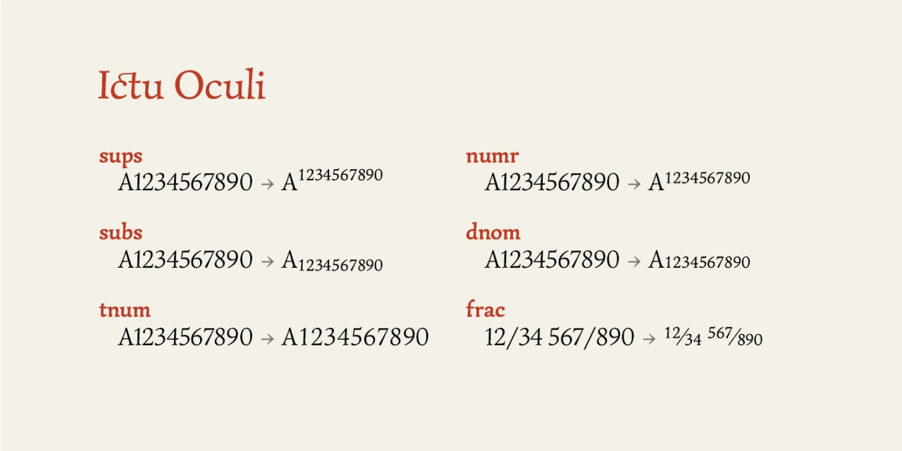
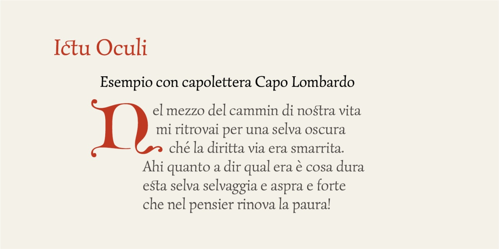

# Ictu Oculi
- Versione 1.145: aggiunta caratteri (e.g. ⁋ ẞ)
- Versione 1.142: aggiunta frecce
- Versione 1.139: sistemazioni minori
- Versione 1.136: aggiunta __tnum__
- Versione 1.131: sistemazioni minori
- Versione 1.128: modifica lettera Q e aggiunta di alcune legature
- Versione 1.125: aggiunta di alcuni caratteri
- Versione 1.119: aggiunta legature st ct e alcuni caratteri
- Versione 1.101: fix caratteri light
- Versione 1.0: versione iniziale

Per testare il font, vedere la [pagina interattiva](https://m-casanova.github.io/IctuOculi/).

## Descrizione

Il font **Ictu Oculi** è derivato da _[Simonetta](https://github.com/google/fonts/tree/main/ofl/simonetta)_ realizzato da Gayaneh Bagdasaryan per Brownfox e distribuito con licenza OFL 1.1.

**Ictu Oculi** è una versione variabile, ma con alcune modifiche. Al momento non si è considerato il corsivo, ma si è estrapolata una versione "Light".

Dalla versione 1.128 è stata modificata la lettera Q (la versione originale è disponibile come __ss01__)

Caratteristiche Opentype

Esempio con capolettera [Capo Lombardo](https://github.com/m-casanova/CapoLombardo)

