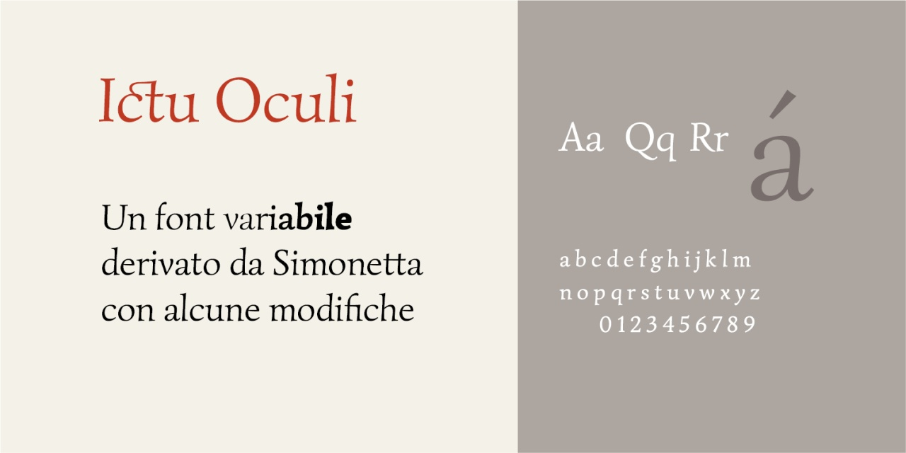

# Ictu Oculi
- Versione 1.119: aggiunta legature st ct e alcuni caratteri
- Versione 1.101: fix caratteri light
- Versione 1.0: versione iniziale

Per testare il font, vedere la [pagina interattiva](https://m-casanova.github.io/IctuOculi/).

## Descrizione

Il font **Ictu Oculi** è derivato da _[Simonetta](https://github.com/google/fonts/tree/main/ofl/simonetta)_ realizzato da Gayaneh Bagdasaryan per Brownfox e distribuito con licenza OFL 1.1.

**Ictu Oculi** è una versione variabile, ma con alcune modifiche. Al momento non si è considerato il corsivo, ma si è estrapolata una versione "Light".

